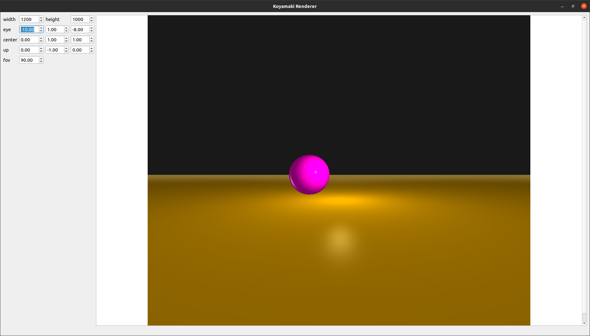

# Koyamaki Renderer  
A little ray tracer I'm writing from scratch in cpp.  

## Current state  
It only renders spheres and planes for now.       
  
  
## How to use it  
You'll need to have the latest version of cmake along with a c++ compiler of your choice:  
```sh  
mkdir build  
cd build  
cmake ..  
make   
```  
The result will be shown in a fancy Qt UI curtesy of Morten Borup Petersen.   
  
## Dependencies  
The only dependencie is Qt, due to the UI:  
- For ubuntu users:  
```sh  
  sudo apt-get install qt5-default
```  
- For everyone else: install `qt5-default` with your package manager of choice or visit [Qt's website](https://doc.qt.io/qt-5/linux.html).  


