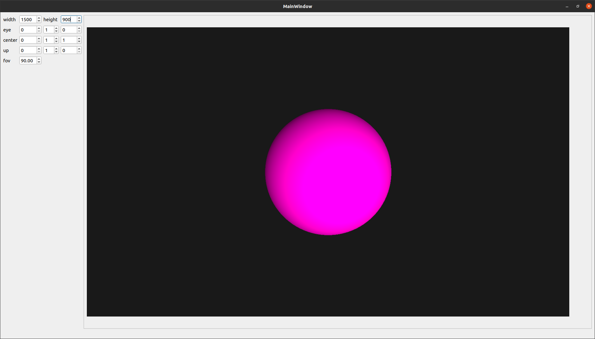

# RaytracingFun
A little ray tracer I'm writing from scratch in cpp.  

## Current state  
It only renders spheres.     
  
  
## How to use it  
You'll need to have the latest version of cmake along with a c++ compiler of your choice:  
```sh  
mkdir build  
cd build  
cmake ../src  
make   
```  
The result will be shown in a fancy Qt UI curtesy of Morten Borup Petersen.   

